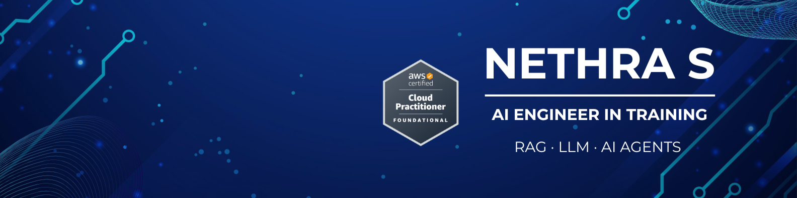

# Nethra S

### AI Engineer in Training • LLMs • RAG • AI Agents

---

##  About

I'm a third-year Computer Science Engineering student at **Sri Eshwar College of Engineering**, passionate about building intelligent applications with **Large Language Models, Retrieval-Augmented Generation, AI Agents, and Machine Learning**.

### Currently Learning

- Agentic AI
- Multi-Agent Systems
- AWS Cloud

---

##  Tech Stack

### AI & Machine Learning

---

##  Featured Projects

<table>
<tr>
<td width="50%">

### 📚 AI Library Recommendation System

Semantic recommendation using Sentence Transformers, FAISS, and Groq.

</td>

<td width="50%">

### 🤖 RAG Chatbot

Document Question Answering using LangChain and Vector Search.

</td>
</tr>
</table>

---

##  Connect

